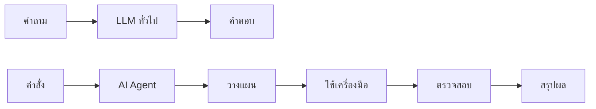

# บทที่ 1: AI Agent คืออะไร

---

## คุณเคยสงสัยไหม?

เวลาใช้ ChatGPT หรือ Claude คุณถามคำถามแล้วได้คำตอบกลับมา — นั่นคือการใช้ LLM (Large Language Model) แบบตรงไปตรงมา

แต่ถ้าเราอยากให้ AI **ทำงานแทนเรา** มากกว่าแค่ตอบคำถามล่ะ? เช่น:

- "ช่วยหาข้อมูลบริษัทนี้ แล้วส่งอีเมลสรุปให้ทีมขาย"
- "ตรวจสอบโค้ดใน Pull Request นี้ แล้วแก้ไขบั๊กที่เจอ"
- "ค้นหาข้อมูลราคาหุ้นย้อนหลัง วิเคราะห์แนวโน้ม แล้วทำกราฟ"

นี่คือจุดที่ **AI Agent** เข้ามา

---

## AI Agent คืออะไร?

**AI Agent** คือระบบที่ใช้โมเดลภาษา (LLM) เป็นสมอง แล้วเพิ่มความสามารถรอบด้านเข้าไป:

| องค์ประกอบ | หน้าที่ |
|------------|---------|
| **LLM / สมอง** | คิด วางแผน ตัดสินใจ |
| **Tools / เครื่องมือ** | ค้นเว็บ คำนวณ อ่านไฟล์ เรียก API |
| **Memory / ความจำ** | จำบริบท จำประวัติ จำข้อมูลผู้ใช้ |
| **Loop / วงรอบ** | ทำงานซ้ำ: วางแผน → ลงมือ → ดูผล → ปรับแผน |

---

## Agent ≠ LLM



LLM ทั่วไปรับคำถามแล้วตอบเลย

AI Agent รับงาน -> วางแผน -> ใช้เครื่องมือ -> ตรวจสอบ -> ปรับปรุง -> สรุปผล

---

## ตัวอย่างที่ทำให้เห็นภาพ

### LLM ทั่วไป
```
คุณ: หุ้น ADVANC วันนี้ราคาเท่าไหร่
AI: ขอโทษครับ ผมไม่มีข้อมูลราคาหุ้นแบบ real-time
```

### AI Agent
```
คุณ: หุ้น ADVANC วันนี้ราคาเท่าไหร่ พร้อมสรุปแนวโน้ม
Agent: [วางแผน] ต้องค้นหาข้อมูลราคาล่าสุด
       [ใช้เครื่องมือ] เรียก API ราคาหุ้น -> ได้ราคาล่าสุด
       [ใช้เครื่องมือ] ค้นหาข่าว ADVANC ล่าสุด
       [วิเคราะห์] ราคาเปลี่ยนเทียบกับเมื่อวาน แนวโน้มระยะสั้น
       [สรุป] ราคาล่าสุด 230 บาท +2.3% แนวโน้มขาขึ้นจากข่าว 5G
```

---

## แกนหลักของ AI Agent

1. **Planning** — แตกงานออกเป็นขั้นตอน
2. **Tool-use** — เลือกและเรียกใช้เครื่องมือที่เหมาะสม
3. **Memory** — จดจำสิ่งที่ทำไปแล้ว
4. **Reflection** — ตรวจสอบและปรับปรุงผลลัพธ์
5. **Human-in-the-loop** — ขออนุมัติหรือคำแนะนำเมื่อจำเป็น

---

## ความเข้าใจผิดที่พบบ่อย

> "AI Agent คือ chatbot ที่เก่งขึ้น"

ไม่ถูก全部ครับ AI Agent ไม่ได้เก่งแค่ตอบ — มัน **ลงมือทำ** ได้ด้วย ใช้เครื่องมือ วางแผน ตรวจสอบตัวเอง chatbot ไม่มีวงรอบทำงานแบบนี้

> "Agent ต้องซับซ้อนและใช้โค้ดเยอะ"

Agent พื้นฐานสุดมีแค่วงวน: `คิด -> ใช้เครื่องมือ -> สังเกตผล -> คิดต่อ` ไม่กี่สิบบรรทัดก็เขียนได้

---

## สรุป

- AI Agent คือ LLM + Tools + Memory + Loop
- ต่างจาก LLM ทั่วไปตรงที่ Agent "ลงมือทำ" ไม่ใช่แค่ "ตอบ"
- องค์ประกอบสำคัญ: วางแผน ใช้เครื่องมือ จดจำ ตรวจสอบ ขอมนุษย์อนุมัติ
- Agent ไม่จำเป็นต้องซับซ้อน เริ่มต้นได้จากแนวคิดง่ายๆ

---

**บทต่อไป:** [Chatbot vs AI Agent](02-chatbot-vs-ai-agent.md) — เมื่อไรควรใช้แค่ chatbot เมื่อไรควรใช้ Agent
