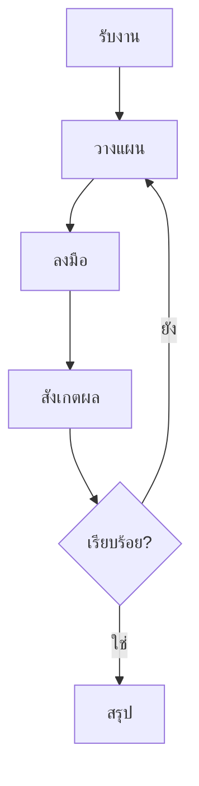

# บทที่ 3: Agentic Workflow

---

หัวใจของ AI Agent ไม่ได้อยู่ที่โมเดลภาษาอย่างเดียว แต่อยู่ที่ **วิธีการทำงาน** — การที่ Agent ทำงานเป็นวงรอบ (loop) ไม่ใช่ตอบครั้งเดียวจบ

---

## Agentic Workflow คืออะไร?

Agentic Workflow คือรูปแบบการทำงานที่ Agent:

1. **วางแผน** (Plan) — เข้าใจงาน แตกเป็นขั้นตอน
2. **ลงมือ** (Act) — ใช้เครื่องมือ ตอบคำถาม หรือทำงานย่อย
3. **สังเกตผล** (Observe) — ดูผลลัพธ์จากการลงมือ
4. **ปรับปรุง** (Improve) — ปรับแผนตามผลลัพธ์
5. **ทำซ้ำ** (Loop) — จนกว่างานจะสำเร็จ



---

## ตัวอย่าง: Agent หาข้อมูลและสรุป

### Step 1 — รับงาน
```
คุณ: "หาข้อมูลตลาด AI ในไทยปี 2025 แล้วสรุปให้ฉัน"
```

### Step 2 — วางแผน
```
Agent: งานนี้ต้อง:
  1. ค้นหาข้อมูลตลาด AI ประเทศไทยล่าสุด
  2. อ่านบทวิเคราะห์จากแหล่งที่น่าเชื่อถือ
  3. สรุปเป็นประเด็นสำคัญ
  4. อ้างอิงแหล่งที่มา
```

### Step 3 — ลงมือ (รอบที่ 1)
```
Agent ใช้ tool ค้นหา: "AI market Thailand 2025 report"
ได้ผลลัพธ์: บทความจาก Krungsri Research, Techsauce, Bloomberg
```

### Step 4 — สังเกตผล
```
Agent: พบบทความ 3 แหล่ง แต่ข้อมูลบางส่วนไม่ตรงกัน
       ต้องอ่านเพิ่มเพื่อยืนยันตัวเลข
```

### Step 5 — ปรับแผน
```
Agent: จะอ่านทั้ง 3 แหล่ง เปรียบเทียบตัวเลข
       และระบุความแตกต่างในสรุป
```

### Step 6 — ลงมือ (รอบที่ 2)
```
Agent ใช้ tool: อ่านบทความแต่ละแหล่ง
```

### Step 7 — วนจนเสร็จ
```
Agent: สรุปพร้อมอ้างอิงเสร็จ ส่งให้ผู้ใช้
```

---

## รูปแบบ Agentic Workflow ที่พบบ่อย

| Pattern | คำอธิบาย |
|---------|----------|
| **ReAct** (Reason + Act) | คิด -> ลงมือ -> สังเกต -> คิดต่อ วนไป |
| **Plan-and-Execute** | วางแผนทั้งหมดก่อน แล้วค่อย Execute |
| **Reflection** | ทำงาน -> ตรวจสอบ -> แก้ไข -> ตรวจสอบอีก |
| **Tool-use Loop** | วนเรียกใช้เครื่องมือจนได้ข้อมูลครบ |
| **Human-in-the-loop** | หยุดรอมนุษย์อนุมัติในขั้นตอนสำคัญ |

---

## องค์ประกอบสำคัญใน Workflow

### System Prompt
คำสั่งที่บอก Agent ว่ามันคือใคร มีเครื่องมืออะไร ทำงานยังไง

### Tool Registry
ทะเบียนเครื่องมือทั้งหมดที่ Agent เรียกใช้ได้ พร้อม schema และคำอธิบาย

### Memory Manager
ส่วนที่จัดการ上下文 เก็บประวัติ และเรียกค้นข้อมูลที่เกี่ยวข้อง

### Router / Planner
ส่วนที่决定下一步 — ใช้ LLM ตัดสินใจว่าจะทำอะไรต่อ

### Observer / Monitor
ส่วนที่บันทึก logs, traces, metrics ทุกขั้นตอน

---

## ความท้าทาย

- **Cost** — ยิ่งวนหลายรอบ ยิ่งใช้ token มาก
- **Latency** — แต่ละรอบต้องรอ LLM ตอบ
- **Error accumulation** — ผิดตั้งแต่รอบแรก ส่งผลถึงรอบต่อไป
- **Infinite loop** — Agent ติด loop ไม่รู้จบ ต้องมีขีดจำกัด
- **Observability** — ถ้าไม่เห็นขั้นตอน จะแก้ไขยาก

---

## การป้องกันปัญหา

| ปัญหา | วิธีป้องกัน |
|-------|------------|
| Infinite loop | จำกัดจำนวน maximum iterations |
| Cost สูงเกิน | ตั้ง limit token และ early stopping |
| Error accumulation | ตรวจสอบผลลัพธ์ทุกขั้นตอน (verification step) |
| Agent หลงทาง | ให้ re-plan หรือขอความช่วยเหลือ |
| ขาดความโปร่งใส | log ทุก action, thought, tool result |

---

## ความเข้าใจผิดที่พบบ่อย

> "Agentic workflow ยิ่งซับซ้อนยิ่งดี"

ยิ่งซับซ้อนยิ่งมีจุดผิดพลาดมาก เริ่มจาก workflow ง่ายๆ ก่อน แล้วเพิ่มความซับซ้อนเมื่อจำเป็น

> "Agent ต้องวน loop จนกว่าจะ perfect"

ไม่เสมอไป ควรมี criteria ชัดเจนว่า "พอ" เมื่อไหร่ — ได้ผลลัพธ์ที่ acceptable ก็หยุดได้

---

## สรุป

- Agentic Workflow คือวงรอบ Plan → Act → Observe → Improve
- มีหลาย Pattern ให้เลือกตามงาน
- ต้องจัดการ cost, latency, error, infinite loop
- เริ่มจากง่ายก่อนเสมอ
- Logging และ Observability คือเพื่อนที่ดีที่สุด

---

**บทต่อไป:** [Tool-use และ Function Calling](04-tool-use.md) — การให้ Agent ใช้เครื่องมืออย่างปลอดภัย
