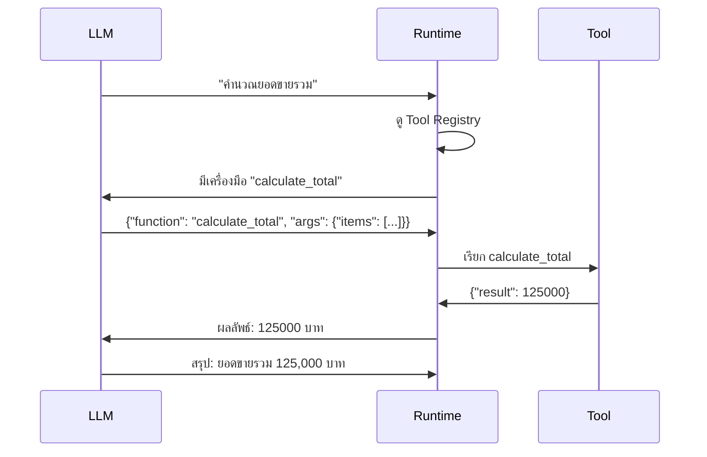

# บทที่ 4: Tool-use และ Function Calling

---

Agent จะเก่งขึ้นมากเมื่อสามารถ **ใช้เครื่องมือภายนอก** ได้ — ไม่ใช่แค่ตอบจากความรู้ในโมเดล แต่สามารถค้นข้อมูล คำนวณ เรียก API หรือทำงานต่างๆ ได้จริง

---

## Tool-use คืออะไร?

**Tool-use** คือความสามารถของ Agent ในการเรียกใช้เครื่องมือหรือฟังก์ชันภายนอก

Agent ไม่ได้ถูกออกแบบให้ทำทุกอย่างได้ด้วยตัวเอง — ข้อดีของ LLM คือการ "คิด" และ "ตัดสินใจ" ว่าควรใช้อะไร แต่การ "ทำ" จริงๆ ควร delegate ให้เครื่องมือ

### ตัวอย่างเครื่องมือที่ Agent ใช้บ่อย

| เครื่องมือ | ใช้ทำอะไร |
|------------|-----------|
| Web Search | ค้นหาข้อมูลปัจจุบัน |
| Calculator | คำนวณเลขที่แม่นยำ |
| Code Interpreter | รันโค้ด วิเคราะห์ข้อมูล |
| File Reader | อ่านไฟล์ PDF, CSV, Excel |
| API Client | เรียก REST API |
| Database Query | สืบค้นฐานข้อมูล |
| Email Sender | ส่งอีเมล |

---

## Function Calling ทำงานยังไง?

Function Calling เป็นกลไกที่ LLM ใช้ในการเลือกและเรียกใช้ฟังก์ชัน:

1. **Register** — ลงทะเบียนเครื่องมือพร้อม schema
2. **Decide** — LLM ตัดสินใจว่า "ตอนนี้ควรใช้เครื่องมือใด"
3. **Call** — LLM ส่ง structured request (เช่น JSON) บอกชื่อฟังก์ชันและ parameter
4. **Execute** — ระบบรันฟังก์ชันนั้น
5. **Return** — ส่งผลลัพธ์กลับให้ LLM
6. **Continue** — LLM ใช้ผลลัพธ์เพื่อคิดหรือตัดสินใจขั้นต่อไป



---

## Tool Schema

เครื่องมือแต่ละตัวต้องมีคำอธิบายที่ LLM เข้าใจ — เรียกว่า **Tool Schema**:

```json
{
  "name": "search_web",
  "description": "ค้นหาข้อมูลจากอินเทอร์เน็ต ใช้เมื่อต้องการข้อมูลปัจจุบัน",
  "parameters": {
    "query": {
      "type": "string",
      "description": "คำค้นหา"
    },
    "max_results": {
      "type": "integer",
      "description": "จำนวนผลลัพธ์สูงสุด",
      "default": 5
    }
  }
}
```

Schema ที่ดีต้อง:
- ชื่อฟังก์ชันสื่อความหมาย
- Description ชัดเจน ว่าใช้เมื่อไร
- Parameters มี type และ description
- บอก default value ถ้ามี

---

## ความปลอดภัยในการใช้ Tool

นี่คือส่วนสำคัญที่สุดของ Tool-use:

### หลักการ

1. **Least Privilege** — ให้ Agent ใช้เท่าที่จำเป็นเท่านั้น
2. **Human Approval** — งานสำคัญต้องขออนุมัติก่อน
3. **Input Validation** — ตรวจสอบ parameter ก่อนเรียกใช้
4. **Output Filtering** — ตรวจสอบผลลัพธ์ก่อนส่งให้ LLM
5. **Rate Limiting** — จำกัดจำนวนครั้งที่เรียกใช้
6. **Audit Log** — บันทึกทุกการเรียกใช้เครื่องมือ

### ตัวอย่างแนวทาง

| เครื่องมือ | ระดับความเสี่ยง | การควบคุม |
|------------|----------------|-----------|
| ค้นหาเว็บ | ต่ำ | จำกัดจำนวนครั้ง |
| อ่านไฟล์ | กลาง | จำกัดประเภทไฟล์และขนาด |
| ส่งอีเมล | สูง | ต้องขออนุมัติทุกครั้ง |
| ลบข้อมูล | สูงมาก | Human-in-the-loop + ยืนยัน |
| เรียก API การเงิน | สูงมาก | Read-only เท่านั้น |

---

## การจัดการ Tool Result

ผลลัพธ์จากเครื่องมือต้องจัดการอย่างดี:

- **Truncation** — ผลลัพธ์อาจยาว ต้องตัดให้พอดีกับ context window
- **Error Handling** — ถ้าเครื่องมือ error ต้องบอก Agent ให้ลองใหม่หรือใช้วิธีอื่น
- **Format** — จัดรูปแบบให้ LLM อ่านง่าย
- **Security** — ไม่ส่ง sensitive data กลับไป LLM โดยไม่จำเป็น

### ตัวอย่าง Error Handling

```
Agent เรียก API หุ้น -> API ล่ม
Runtime ส่ง: {"error": "service_unavailable", "message": "API ล่ม"}
Agent: API ล่ม ลองแหล่งสำรอง
Agent เรียก API หุ้น (แหล่ง 2) -> สำเร็จ
```

---

## ความเข้าใจผิดที่พบบ่อย

> "LLM เรียก function ได้เองโดยไม่ต้องมีระบบรองรับ"

LLM แค่ **ขอ** เรียก function — ระบบภายนอก (Runtime) ต่างหากที่เป็นคนดำเนินการและส่งผลกลับ

> "Tool schema ยิ่งละเอียดยิ่งดี"

ละเอียดพอที่ LLM เข้าใจ แต่ไม่ต้องยาวเกินไป — natural language ที่ LLM อ่านแล้วเข้าใจก็พอ

> "ถ้า Agent มี tools เยอะ จะทำงานได้ดีขึ้น"

Tools ที่มากเกินไปทำให้ LLM สับสน เลือกผิด เลือกช้า ควรมีเฉพาะ tools ที่จำเป็น

---

## สรุป

- Tool-use ทำให้ Agent ทำงานได้มากกว่าแค่ใช้ความรู้ในโมเดล
- Function Calling คือกลไกที่ LLM ขอเรียก function ผ่าน structured output
- Tool Schema คือคู่มือให้ LLM รู้จักเครื่องมือ
- ความปลอดภัยต้องมาก่อน — มีขอบเขต ขออนุญาต และบันทึก
- Error handling และการจัดการผลลัพธ์สำคัญไม่แพ้กัน

---

**บทต่อไป:** [Memory และ Context](05-memory-and-context.md) — การทำให้ Agent จดจำและมีบริบท
