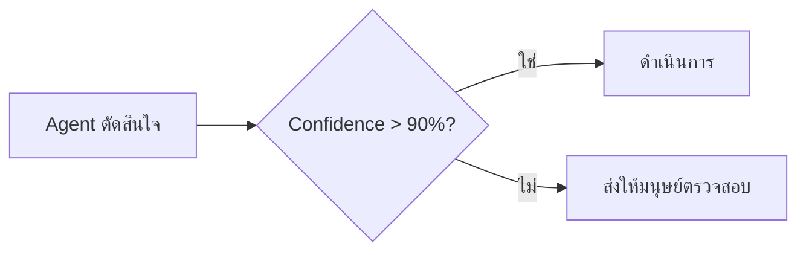

# บทที่ 7: Human-in-the-loop

---

AI Agent จะฉลาดแค่ไหน มนุษย์ยังคงเป็นส่วนสำคัญของการทำงาน

Human-in-the-loop (HITL) คือการออกแบบให้ **มนุษย์อยู่ในกระบวนการตัดสินใจ** ไม่ใช่ปล่อยให้ Agent ทำงานทุกอย่างเอง

---

## ทำไมต้อง Human-in-the-loop?

| เหตุผล | คำอธิบาย |
|--------|----------|
| **ความปลอดภัย** | Agent ทำผิดได้ — มนุษย์เป็นด่านสุดท้าย |
| **ความถูกต้อง** | Agent อาจ hallucinate — มนุษย์ตรวจสอบได้ |
| **จริยธรรม** | การตัดสินใจที่ sensitive ต้องมีมนุษย์รับผิดชอบ |
| **บริบทที่ซับซ้อน** | Agent ไม่เข้าใจ nuance ทั้งหมด |
| **ความไว้วางใจ** | ผู้ใช้ trust ระบบที่มีมนุษย์ตรวจสอบ |
| **ข้อกําหนดทางกฎหมาย** | บางอุตสาหกรรม require human approval |

---

## ระดับของ Human-in-the-loop

### 1. Human-in-the-loop (HITL)
มนุษย์อยู่ในทุกขั้นตอน — Agent ทำงานย่อยแล้วขออนุมัติก่อนไปต่อ

```
Agent: "พบข้อมูลครบแล้ว กำลังจะส่งอีเมล..."
    ↳ หยุด รอมนุษย์อนุมัติ
มนุษย์: "อนุมัติ" →
Agent: "ส่งอีเมลแล้ว"
```

### 2. Human-on-the-loop (HOTL)
มนุษย์ไม่ต้องตรวจสอบทุกครั้ง แต่สามารถ interven ได้เมื่อต้องการ

```
Agent: ทำงานไปเรื่อยๆ
มนุษย์: "เดี๋ยวก่อน ขอดูแผนก่อน" → เช็ค → "โอเค ไปต่อ"
Agent: ทำงานต่อ
```

### 3. Human-in-command (HIC)
มนุษย์เป็นผู้สั่งการ — Agent เสนอทางเลือก มนุษย์เลือก

```
Agent: "วิเคราะห์เสร็จ มี 3 ทางเลือก:
   A. เพิ่มงบการตลาด 20%
   B. ลดราคาสินค้า 10%
   C. เปิดตลาดใหม่
   โปรดเลือก"
มนุษย์: "A"
Agent: "ดำเนินการแผน A"
```

---

## จุดที่ควรให้มนุษย์ตรวจสอบ

| จุด | เหตุผล |
|-----|--------|
| **ก่อนส่งข้อความสำคัญ** | เช่น อีเมล หาคู่ สัญญา |
| **ก่อนเรียก API ที่มีการเขียน/ลบ** | ป้องกันข้อมูลเสียหาย |
| **ก่อนชำระเงิน** | การเงินต้องระวัง |
| **เมื่อ Agent ไม่แน่ใจ** | confidence threshold |
| **เมื่อเจอข้อมูล sensitive** | เช่น ข้อมูลส่วนบุคคล |
| **ก่อน deployment** | ต้อง human review |

### Threshold-based Intervention



---

## การออกแบบ Approval Workflow

### Simple Approval
```
Agent: เสนอ → มนุษย์: อนุมัติ/ปฏิเสธ → Agent: ทำต่อ
```

### Multi-step Approval
```
Agent: เสนอ → มนุษย์ A: ตรวจสอบ → มนุษย์ B: อนุมัติ → Agent: ทำต่อ
```

### Review with Feedback
```
Agent: เสนอ → มนุษย์: แก้ไข → Agent: ปรับตาม feedback → มนุษย์: อนุมัติ
```

---

## Audit Trail

ทุกครั้งที่ Agent ทำงาน — ต้องบันทึกไว้ตรวจสอบได้:

```
[2025-05-25 10:00] Agent: เริ่มทำงาน "ส่งอีเมลการตลาด"
[2025-05-25 10:01] Agent: ร่างอีเมลเสร็จ → รออนุมัติ
[2025-05-25 10:05] มนุษย์ (สมชาย): อนุมัติ
[2025-05-25 10:05] Agent: เรียก API ส่งอีเมล → สำเร็จ
[2025-05-25 10:05] Agent: งานเสร็จ
```

ข้อมูลที่ควรบันทึก:
- **Timestamp** — เวลาที่เกิดเหตุการณ์
- **Actor** — Agent หรือมนุษย์? คนไหน?
- **Action** — ทำอะไร?
- **Input/Output** — รับอะไร ส่งอะไร
- **Decision** — ตัดสินใจอย่างไร
- **Reason** — ถ้ามนุษย์ override, เพราะอะไร?

---

## ข้อควรระวัง

| ปัญหา | วิธีป้องกัน |
|-------|------------|
| **มนุษย์ไม่ตรวจสอบจริง** (automation bias) | บังคับให้อ่านก่อน approve |
| **มนุษย์ตอบช้า** งานค้าง | แจ้งเตือน + escalation |
| **มนุษย์ไม่อยู่** | ตั้ง timeout + fallback |
| **มนุษย์ขี้เกียจ approve ทุกอย่าง** | random audit check |
| **Context switching** | ให้ข้อมูลครบในการขออนุมัติ |

---

## ความเข้าใจผิดที่พบบ่อย

> "Human-in-the-loop ทำให้ระบบช้า"

ช้าลงนิดหน่อย แต่ปลอดภัยกว่ามาก — โดยเฉพาะในงานที่ผิดพลาดแล้วเสียหายร้ายแรง

> "เดี๋ยว Agent เก่งขึ้นแล้วไม่ต้องมีมนุษย์"

Agent อาจเก่งขึ้น แต่ความรับผิดชอบและความปลอดภัยยังต้องมีมนุษย์ — โดยเฉพาะการตัดสินใจที่ส่งผลกระทบ

> "HITL = ต้อง approve ทุกอย่าง"

ไม่ใช่ — HITL คือการออกแบบให้มนุษย์อยู่ในจุดที่ควรอยู่ ไม่ใช่ทุกจุด

---

## สรุป

- Human-in-the-loop ทำให้ระบบ AI ปลอดภัยและน่าเชื่อถือ
- มีหลายระดับ: HITL, HOTL, HIC — เลือกตามความเหมาะสม
- ต้องออกแบบ workflow การอนุมัติที่ชัดเจน
- Audit trail คือสิ่งจำเป็น — ตรวจสอบย้อนหลังได้ทุกขั้นตอน
- อย่าให้มนุษย์เป็น bottleneck — ออกแบบ UI/UX การอนุมัติให้ดี

---

**บทต่อไป:** [MCP (Model Context Protocol)](08-mcp.md) — โปรโตคอลเชื่อมต่อ Agent กับเครื่องมือ
