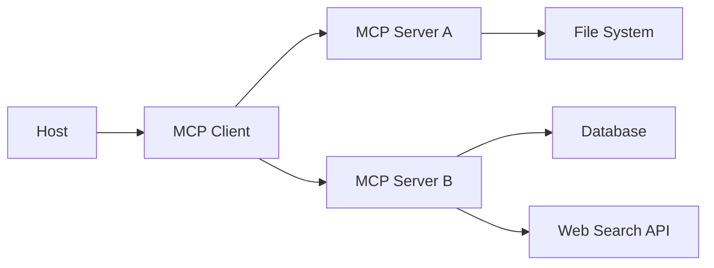

# บทที่ 8: MCP (Model Context Protocol)

---

เวลา Agent อยากใช้เครื่องมือใหม่ๆ ปัญหาหนึ่งที่เจอคือ **ทุกเครื่องมือมีวิธีเชื่อมต่อไม่เหมือนกัน**

MCP ถูกสร้างมาเพื่อแก้ปัญหานี้

---

## MCP คืออะไร?

**MCP (Model Context Protocol)** คือโปรโตคอลแบบเปิด ที่กำหนดมาตรฐานการเชื่อมต่อระหว่าง Agent (หรือ LLM) กับเครื่องมือและแหล่งข้อมูล

คิดเสียว่า MCP เป็น **USB-C ของ AI Agent** — ไม่ว่าเครื่องมืออะไร ถ้าเชื่อมต่อผ่าน MCP ก็ใช้ร่วมกับ Agent ที่รองรับได้ทันที

---

## ทำไมต้อง MCP?

ก่อนมี MCP:

```
Agent A
├─ ใช้ Tool A → ต้องเขียน adapter เอง
├─ ใช้ Tool B → ต้องเขียน adapter ต่างหาก
└─ ใช้ Tool C → adapter อีกแบบ

Agent B
├─ ใช้ Tool A → เขียน adapter ใหม่ (ซ้ำกับ Agent A)
└─ ...
```

หลังมี MCP:

```
Agent A ─┐
Agent B ─┼── MCP Protocol ──┬── Tool A
Agent C ─┘                  ├── Tool B
                            ├── Tool C
                            └── ...
```

---

## สถาปัตยกรรม MCP

### MCP Host
แอปพลิเคชันที่รัน Agent เช่น Claude Desktop, IDE plugin, custom app

### MCP Client
ส่วนใน Host ที่ทำหน้าที่เชื่อมต่อกับ MCP Server — ส่ง request, รับ response

### MCP Server
เซิร์ฟเวอร์ที่ expose เครื่องมือหรือข้อมูลผ่าน MCP Protocol



---

## ความสามารถของ MCP Server

| ความสามารถ | คำอธิบาย |
|-------------|----------|
| **Tools** | ฟังก์ชันที่ Agent เรียกใช้ได้ — ค้นหา อ่านไฟล์ คำนวณ |
| **Resources** | ข้อมูลที่ Agent อ่านได้ — ไฟล์, เอกสาร, database |
| **Prompts** | template prompt สำเร็จรูปที่ Agent ใช้งานได้ |
| **Sampling** | (optional) server ขอให้ LLM สร้างข้อความเพิ่ม |

---

## ตัวอย่าง MCP Server ง่ายๆ

MCP Server ที่ให้ Agent ค้นหาสภาพอากาศ:

```json
// Tool schema ที่ MCP Server ประกาศ
{
  "name": "get_weather",
  "description": "ค้นหาสภาพอากาศปัจจุบัน",
  "inputSchema": {
    "type": "object",
    "properties": {
      "location": {
        "type": "string",
        "description": "ชื่อเมือง"
      }
    }
  }
}
```

Agent เรียกใช้ผ่าน MCP Client:

```
Agent: "อากาศวันนี้ที่กรุงเทพเป็นไง"
MCP Client → MCP Server (get_weather, location: "กรุงเทพ")
MCP Server → API สภาพอากาศ → {"temp": 35, "humid": 70}
MCP Client → Agent
Agent: "อากาศที่กรุงเทพวันนี้ 35 องศา ความชื้น 70%"
```

---

## MCP vs Function Calling

| | Function Calling | MCP |
|---|-----------------|-----|
| **มาตรฐาน** | ขึ้นกับ provider (OpenAI, Anthropic, etc.) | โปรโตคอลเปิด |
| **การเชื่อมต่อ** | ประกาศใน API call | client-server |
| **Transport** | HTTP (API provider) | stdio, HTTP (SSE) |
| **Discovery** | schema ส่งพร้อม request | server ประกาศ capabilities |
| **เครื่องมือหลายตัว** | ต้อง register ทั้งหมดใน request | connect หลาย server ได้ |
| **ความยืดหยุ่น** | provider เป็นคนกำหนด | developer ตั้งค่าเองได้ |

---

## เมื่อไรควรใช้ MCP

### เหมาะกับ
- ต้องการให้ Agent ใช้เครื่องมือที่คุณเขียนเอง
- ต้องการเชื่อมต่อ Agent กับระบบภายใน (internal tools, database)
- สร้างระบบที่ Agent เชื่อมต่อหลายแหล่งข้อมูล
- พัฒนาเครื่องมือที่ใช้กับ Agent หลายตัวได้

### ไม่จำเป็น
- ถ้าใช้แค่ API search หรือ calculator พื้นฐาน (Function Calling ก็พอ)
- ถ้า Agent รองรับ function calling โดยตรงอยู่แล้ว และไม่ต้องการ standard interface

---

## ความเข้าใจผิดที่พบบ่อย

> "MCP แทนที่ Agent framework ได้"

MCP เป็นโปรโตคอลสำหรับเชื่อมต่อเครื่องมือ — ไม่ใช่ framework สำหรับสร้าง Agent ใช้ร่วมกันได้

> "MCP ใช้ได้กับ Claude เท่านั้น"

MCP เป็น open protocol — ออกแบบให้ใช้กับ LLM ตัวอื่นได้ด้วย

> "MCP ซับซ้อนเกินไปสำหรับโปรเจกต์เล็ก"

MCP Server พื้นฐานเขียนไม่กี่สิบบรรทัด — ถ้าต้องการ standard interface คุ้มค่า

---

## สรุป

- MCP คือโปรโตคอลเปิดสำหรับเชื่อมต่อ Agent กับเครื่องมือและข้อมูล
- สถาปัตยกรรม: Host → Client → Server
- MCP Server มี Tools, Resources, Prompts
- MCP ≠ Function Calling แต่เสริมกัน — Function calling เรียก tool, MCP จัดการ connection
- ใช้ MCP เมื่อต้องการระบบที่ยืดหยุ่น ขยายได้ ใช้กับ Agent หลายตัว

---

**บทต่อไป:** [Multi-agent Systems](09-multi-agent.md) — ระบบที่ Agent หลายตัวทำงานร่วมกัน
